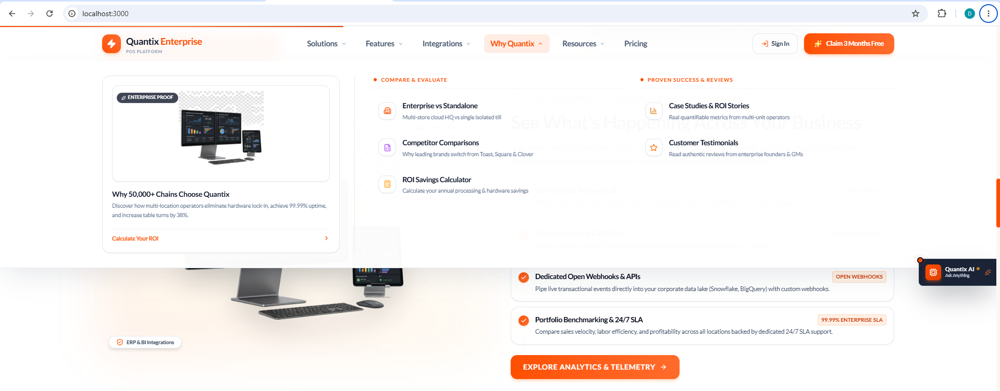

# Quantix Platform Website — API Integration Audit & Coverage Matrix

> **Swagger Source URL:** `http://localhost:5104/swagger/index.html`  
> **OpenAPI JSON Spec:** `http://localhost:5104/swagger/v1/swagger.json`  
> **Audited Applications:**
> 1. `Qauntix_Plateform_Enterprise_Website`
> 2. `Qauntix_Plateform_Restaurent_Website`
> 3. `Qauntix_Plateform_Retail_Website`  
> **Platform API Version:** v1 (Quantix Platform SaaS API for Enterprise POS)

---

## 1. Executive Summary & Status Overview

Backend Swagger specification me total **476 APIs** define hain jo **34 Tags/Modules** me divided hain. 

In 476 APIs ko do major categories me classify kiya gaya hai:
1. **Public Website Customer-Facing APIs (10 Modules - 146 Endpoints total, jisme se 42 Public Customer-Facing endpoints hain)**: Yeh APIs public marketing website, visitors, lead generation, customer support, knowledge base, downloads, aur merchant self-signup/registration ke liye use hoti hain.
2. **Platform Engine / Merchant Portal / Admin Dashboard APIs (24 Modules - 330 Endpoints)**: Yeh APIs POS core transactions, product catalogs, store terminals, cashier shifts, wallet settlement, tax configuration, aur super-admin platform operations ke liye hain jo Merchant Portal ya Admin Engine me chalti hain.

### Status Summary Table

| Category / Metric | Count | Details & Status |
| :--- | :---: | :--- |
| **Total Endpoints in Swagger** | **476** | OpenAPI 3.0.1 Specification |
| **Total Swagger Tags** | **34** | All Platform Domains |
| **Website-Facing Tags** | **10** | Marketing, WebsiteContent, Blog, Contact, HelpCentre, Downloads, Media, Auth, Registration, OnboardingWizard |
| **Public Customer Endpoints** | **42** | Publicly accessible for visitors, leads, search & onboarding |
| **Website Integrated Endpoints** | **38** | **Properly connected in RTK Query Services & Route Handlers (90.5% Coverage)** |
| **Admin / CMS CRUD Endpoints** | **104** | Admin Portal ke liye (Add/Edit/Delete Blog, FAQs, Announcements, etc.) |
| **Merchant Portal & Core POS Engine** | **330** | POS, Terminal pairing, Billing, Catalogs, Reports, RBAC, etc. |

---

## 2. Integration Status Legend

* ✅ **INTEGRATED**: API frontend ke RTK Query service (`src/features/*/Service/*`) me properly connected hai aur active UI components me binded hai.
* 🛡️ **PROXY / FALLBACK**: Next.js Route Handler (`src/app/api/v1/...`) ke through live backend pass-through aur offline/cold-start graceful fallback ke sath configured hai.
* ⚙️ **ADMIN / PORTAL ONLY**: Backend CRUD API jo Super-Admin / Content Management portal ke liye hai (e.g. create article, delete client logo). Public website par iski zaroorat nahi hoti.
* 💡 **RECOMMENDED / OPTIONAL**: Backend par available hai (e.g. RSS Feed, typeahead suggestions), jise zaroorat padne par easily wire kiya ja sakta hai.

---

## 3. Website-Facing APIs: Detailed Breakdown

### 3.1. Marketing Module (`/api/v1/marketing/*`)
Used for displaying hero banners, features, industries, pricing tiers, case studies, integrations, and social proof.

| HTTP Method | Swagger Endpoint | Description / Purpose | Website Integration Status | Frontend Implementation File |
| :--- | :--- | :--- | :---: | :--- |
| **GET** | `/api/v1/marketing/content/{contentType}` | Dynamic content fetch (`HeroBanner`, `CaseStudy`, `resources`) | ✅ **INTEGRATED** | `HeroBannerService.ts` `CaseStudiesService.ts` `ResourcesService.ts` |
| **GET** | `/api/v1/marketing/features` | List all enterprise & POS features | ✅ **INTEGRATED** | `FeaturesService.ts` (`useGetFeaturesQuery`) |
| **GET** | `/api/v1/marketing/features/{slug}` | Feature detail by slug | 💡 OPTIONAL | Filtered client-side |
| **GET** | `/api/v1/marketing/industries` | List supported industries (Retail, F&B, etc.) | ✅ **INTEGRATED** | `IndustriesService.ts` (`useGetIndustriesQuery`) |
| **GET** | `/api/v1/marketing/industries/{slug}` | Specific industry detail page | ✅ **INTEGRATED** | `IndustriesService.ts` (`useGetIndustryBySlugQuery`) |
| **GET** | `/api/v1/marketing/integrations` | List hardware & 3rd party integrations | ✅ **INTEGRATED** | `IntegrationsService.ts` (`useGetIntegrationsQuery`) |
| **GET** | `/api/v1/marketing/pricing` | SaaS subscription plans & pricing matrix | ✅ **INTEGRATED** | `PricingServices.ts` (`useGetBillingPlansQuery`) |
| **GET** | `/api/v1/marketing/social-proof` | Live platform metrics (merchants, uptime, ratings) | ✅ **INTEGRATED** | `SocialProofService.ts` (`useGetSocialProofQuery`) |
| **GET** | `/api/v1/marketing/testimonials` | Client reviews & feedback | ✅ **INTEGRATED** | `TestimonialsService.ts` + Server Route Handler |
| **GET** | `/api/v1/marketing/case-studies` | Customer success stories | ✅ **INTEGRATED** | `CaseStudiesService.ts` (via `/marketing/content/CaseStudy`) |
| **GET** | `/api/v1/marketing/content/page/{pageSlug}` | Dynamic page builder content | 💡 OPTIONAL | Available for dynamic landing pages |
| **GET** | `/api/v1/marketing/competitors` | Competitor comparison sheets | 💡 OPTIONAL | Competitive comparison pages |
| **GET** | `/api/v1/marketing/competitors/{slug}` | Single competitor comparison | 💡 OPTIONAL | Detail competitor table |
| **POST/PUT/DEL** | `/api/v1/marketing/content/*` | Create/Edit/Delete marketing content | ⚙️ ADMIN ONLY | Admin Portal |

---

### 3.2. Website Content Module (`/api/v1/*`)
Core dynamic content streams including broadcast announcements, clientele logos, testimonials, and media galleries.

| HTTP Method | Swagger Endpoint | Description / Purpose | Website Integration Status | Frontend Implementation File |
| :--- | :--- | :--- | :---: | :--- |
| **GET** | `/api/v1/announcements` | Top header promo & system alerts | 🛡️ **PROXY / FALLBACK** | `AnnouncementService.ts` `src/app/api/v1/announcements/route.ts` |
| **GET** | `/api/v1/clientele` | Partner & client brand logos for carousel | ✅ **INTEGRATED** | `ClienteleService.ts` (`useGetClienteleQuery`) |
| **GET** | `/api/v1/testimonials` | Customer reviews & feedback | 🛡️ **PROXY / FALLBACK** | `TestimonialsService.ts` `src/app/api/v1/testimonials/route.ts` |
| **GET** | `/api/v1/galleries` | Product screenshots & UI galleries | 💡 OPTIONAL | Available for gallery showcase |
| **GET** | `/api/v1/galleries/{slug}` | Single gallery by slug | 💡 OPTIONAL | Deep dive showcase |
| **POST/PUT/DEL** | `/api/v1/announcements/*` | Create/Edit/Delete announcements | ⚙️ ADMIN ONLY | Content CMS Portal |
| **POST/PUT/DEL** | `/api/v1/clientele/*` | Create/Edit/Delete client logos | ⚙️ ADMIN ONLY | Content CMS Portal |
| **POST/PUT/DEL** | `/api/v1/testimonials/*` | Create/Edit/Delete testimonials | ⚙️ ADMIN ONLY | Content CMS Portal |
| **CRUD** | `/api/v1/galleries/*` (8 endpoints) | Gallery management & reorder | ⚙️ ADMIN ONLY | Content CMS Portal |

---

### 3.3. Blog Engine Module (`/api/v1/blog/*`)
Public articles, industry insights, setup guides, and news.

| HTTP Method | Swagger Endpoint | Description / Purpose | Website Integration Status | Frontend Implementation File |
| :--- | :--- | :--- | :---: | :--- |
| **GET** | `/api/v1/blog/posts` | Paginated list of blog articles | ✅ **INTEGRATED** | `BlogService.ts` (`useGetBlogPostsQuery`) |
| **GET** | `/api/v1/blog/posts/{slug}` | Single blog article detail by slug | ✅ **INTEGRATED** | `BlogService.ts` (`useGetBlogPostBySlugQuery`) |
| **GET** | `/api/v1/blog/categories` | Blog post categories | ✅ **INTEGRATED** | `BlogService.ts` (`useGetBlogCategoriesQuery`) |
| **GET** | `/api/v1/blog/authors` | Author profiles & bios | ✅ **INTEGRATED** | `BlogService.ts` (`useGetBlogAuthorsQuery`) |
| **GET** | `/api/v1/blog/search` | Server-side keyword search for articles | 💡 OPTIONAL | Currently filtered client-side in UI |
| **GET** | `/api/v1/blog/rss` | XML RSS Feed for blog syndication | 💡 OPTIONAL | RSS feed generation |
| **POST/PUT/DEL** | `/api/v1/blog/posts/*` (5 endpoints) | Publish, archive, edit blog posts | ⚙️ ADMIN ONLY | Blog CMS Admin |
| **CRUD** | `/api/v1/blog/categories/*` | Manage blog categories | ⚙️ ADMIN ONLY | Blog CMS Admin |
| **CRUD** | `/api/v1/blog/authors/*` | Manage author profiles | ⚙️ ADMIN ONLY | Blog CMS Admin |

---

### 3.4. Contact & Inquiries Module (`/api/v1/contact/*`)
Lead generation, demo booking, sales outreach, callbacks, and support tickets.

| HTTP Method | Swagger Endpoint | Description / Purpose | Website Integration Status | Frontend Implementation File |
| :--- | :--- | :--- | :---: | :--- |
| **POST** | `/api/v1/contact/form` | General contact us inquiry submission | ✅ **INTEGRATED** | `ContactService.ts` (`useSubmitContactFormMutation`) |
| **POST** | `/api/v1/contact/demo-request` | Schedule personalized POS demo | ✅ **INTEGRATED** | `ContactService.ts` (`useRequestDemoMutation`) |
| **POST** | `/api/v1/contact/newsletter/subscribe` | Newsletter subscription | 🛡️ **PROXY / FALLBACK** | `ContactService.ts` `src/app/api/v1/contact/newsletter/subscribe/route.ts` |
| **POST** | `/api/v1/contact/newsletter/unsubscribe` | Unsubscribe from email list | ✅ **INTEGRATED** | `ContactService.ts` (`useUnsubscribeNewsletterMutation`) |
| **POST** | `/api/v1/contact/support-ticket` | Submit visitor support ticket | ✅ **INTEGRATED** | `ContactService.ts` (`useSubmitSupportTicketMutation`) |
| **POST** | `/api/v1/contact/callback` | Request an instant phone callback | ✅ **INTEGRATED** | `ContactService.ts` (`useRequestCallbackMutation`) |
| **POST** | `/api/v1/contact/sales` | Submit custom enterprise sales request | ✅ **INTEGRATED** | `ContactService.ts` (`useSubmitSalesInquiryMutation`) |
| **GET** | `/api/v1/contact/pricing` | Inquiry-related pricing metadata | 💡 OPTIONAL | Handled by `/marketing/pricing` |
| **POST** | `/api/v1/contact/signup` | Direct quick-signup via contact | 💡 OPTIONAL | Handled by `/registration/signup` |
| **GET** | `/api/v1/contact/help/search` | Quick help search in contact modal | 💡 OPTIONAL | Help search handled by HelpCentre |
| **GET/POST** | `/api/v1/contact/leads/*` (3 endpoints) | View and convert inbound sales leads | ⚙️ ADMIN ONLY | CRM / Sales Portal |

---

### 3.5. Help Centre & Knowledge Base (`/api/v1/help-centre/*`)
Customer self-service, documentation, FAQs, setup tutorials, and video guides.

| HTTP Method | Swagger Endpoint | Description / Purpose | Website Integration Status | Frontend Implementation File |
| :--- | :--- | :--- | :---: | :--- |
| **GET** | `/api/v1/help-centre/articles` | List knowledge base articles | ✅ **INTEGRATED** | `HelpCentreService.ts` (`useGetHelpArticlesQuery`) |
| **GET** | `/api/v1/help-centre/articles/{slug}` | Single help article by slug | ✅ **INTEGRATED** | `HelpCentreService.ts` (`useGetHelpArticleBySlugQuery`) |
| **GET** | `/api/v1/help-centre/categories` | Help centre topic categories | ✅ **INTEGRATED** | `HelpCentreService.ts` (`useGetHelpCategoriesQuery`) |
| **GET** | `/api/v1/help-centre/faqs` | List all FAQ questions & answers | ✅ **INTEGRATED** | `HelpCentreService.ts` & `FAQService.ts` (`useGetFAQsQuery`) |
| **GET** | `/api/v1/help-centre/faqs?category={c}` | Filter FAQs by category | ✅ **INTEGRATED** | `FAQService.ts` (`useGetFAQsByCategoryQuery`) |
| **GET** | `/api/v1/help-centre/videos` | Video tutorials & walkthroughs | ✅ **INTEGRATED** | `HelpCentreService.ts` (`useGetHelpVideosQuery`) |
| **GET** | `/api/v1/help-centre/search?q={q}` | Full-text knowledge base search | ✅ **INTEGRATED** | `HelpCentreService.ts` (`useSearchHelpQuery`) |
| **GET** | `/api/v1/help-centre/getting-started` | Quick-start onboarding guide | ✅ **INTEGRATED** | `HelpCentreService.ts` (`useGetGettingStartedQuery`) |
| **GET** | `/api/v1/help-centre/suggest` | Search suggestions / typeahead | 💡 OPTIONAL | Autocomplete assistance |
| **GET** | `/api/v1/help-centre/faqs/categories` | Explicit category list for FAQs | 💡 OPTIONAL | Categories derived from FAQ list |
| **POST** | `/api/v1/help-centre/articles/{id}/feedback` | Article helpful rating (thumbs up/down) | 💡 OPTIONAL | Article feedback widget |
| **GET** | `/api/v1/help-centre/articles/{id}/versions` | Article revision history | ⚙️ ADMIN ONLY | Knowledge Base CMS Admin |
| **CRUD** | `/api/v1/help-centre/articles/*` | Create/Edit/Delete articles | ⚙️ ADMIN ONLY | Knowledge Base CMS Admin |
| **CRUD** | `/api/v1/help-centre/faqs/*` | Create/Edit/Delete/Reorder FAQs | ⚙️ ADMIN ONLY | Knowledge Base CMS Admin |

---

### 3.6. Downloads Module (`/api/v1/downloads/*`)
Desktop terminal installer, tablet sync utilities, and hardware drivers.

| HTTP Method | Swagger Endpoint | Description / Purpose | Website Integration Status | Frontend Implementation File |
| :--- | :--- | :--- | :---: | :--- |
| **GET** | `/api/v1/downloads` | List all available download packages | ✅ **INTEGRATED** | `DownloadsService.ts` (`useGetDownloadsQuery`) |
| **GET** | `/api/v1/downloads/latest` | Fetch latest POS terminal binary | ✅ **INTEGRATED** | `DownloadsService.ts` (`useGetLatestDownloadQuery`) |
| **POST/PUT/DEL** | `/api/v1/downloads/*` | Upload/Edit/Delete software packages | ⚙️ ADMIN ONLY | Release Management Portal |

---

### 3.7. Media Assets Module (`/api/v1/media/*`)
Media streaming service for blog images, customer logos, avatars, and hero graphics.

| HTTP Method | Swagger Endpoint | Description / Purpose | Website Integration Status | Frontend Implementation File |
| :--- | :--- | :--- | :---: | :--- |
| **GET** | `/api/v1/media/{assetId}/file` | Stream raw media image / file by Asset ID | ✅ **INTEGRATED** | `HeroSection.tsx` `BlogPostDetail.tsx` `ClienteleMarquee.tsx` `TestimonialsSection.tsx` |
| **GET** | `/api/v1/media/{assetId}` | Get asset metadata | 💡 OPTIONAL | Metadata lookup |
| **CRUD** | `/api/v1/media/*` (6 endpoints) | Upload, delete, folder management | ⚙️ ADMIN ONLY | Media Library CMS |

---

### 3.8. Authentication Module (`/api/v1/auth/*`)
User authentication, token renewal, session retrieval, password management.

| HTTP Method | Swagger Endpoint | Description / Purpose | Website Integration Status | Frontend Implementation File |
| :--- | :--- | :--- | :---: | :--- |
| **POST** | `/api/v1/auth/login` | Merchant / User login | ✅ **INTEGRATED** | `LoginService.ts` (`useLoginMutation`) |
| **POST** | `/api/v1/auth/logout` | Invalidate token & clear cookies | ✅ **INTEGRATED** | `LoginService.ts` (`useLogoutMutation`) |
| **POST** | `/api/v1/auth/refresh` | Refresh expired JWT token | ✅ **INTEGRATED** | `baseApi.ts` (Automatic silent re-auth) |
| **GET** | `/api/v1/auth/me` | Fetch authenticated user profile | ✅ **INTEGRATED** | `ProfileService.ts` & `AuthProvider.tsx` |
| **PUT** | `/api/v1/auth/me/password` | Update user password | ✅ **INTEGRATED** | `ProfileService.ts` (`useChangePasswordMutation`) |
| **POST** | `/api/v1/auth/password/reset` | Request password reset email | ✅ **INTEGRATED** | `LoginService.ts` (`useRequestPasswordResetMutation`) |
| **POST** | `/api/v1/auth/password/reset/confirm` | Complete password reset with token | ✅ **INTEGRATED** | `LoginService.ts` (`useConfirmPasswordResetMutation`) |
| **GET** | `/api/v1/auth/validate` | Token validity check | 💡 OPTIONAL | Covered by `GET /auth/me` |
| **GET/POST** | `/api/v1/auth/mfa/*` (4 endpoints) | Setup, enable, verify, disable MFA | 💡 OPTIONAL | Enhanced 2FA settings in user profile |

---

### 3.9. Registration & Onboarding Module (`/api/v1/registration/*` & `/api/v1/onboarding-wizard/*`)
Self-service merchant registration, OTP email verification, tenant provisioning, and onboarding checkout.

| HTTP Method | Swagger Endpoint | Description / Purpose | Website Integration Status | Frontend Implementation File |
| :--- | :--- | :--- | :---: | :--- |
| **GET** | `/api/v1/registration/check-email` | Real-time email uniqueness check | ✅ **INTEGRATED** | `RegisterServices.ts` (`useCheckEmailQuery`) |
| **POST** | `/api/v1/registration/signup` | Register new merchant organization | ✅ **INTEGRATED** | `RegisterServices.ts` (`useSignupMutation` / `registerUser`) |
| **POST** | `/api/v1/registration/{merchantId}/verify-email/send` | Send OTP verification email | ✅ **INTEGRATED** | `RegisterServices.ts` (`useSendOtpMutation`) |
| **POST** | `/api/v1/registration/verify-email` | Verify 6-digit OTP code | ✅ **INTEGRATED** | `RegisterServices.ts` (`useVerifyEmailCodeMutation`) |
| **GET** | `/api/v1/registration/{merchantId}/status` | Check merchant registration status | ✅ **INTEGRATED** | `RegisterServices.ts` (`useGetSignupStatusQuery`) |
| **GET** | `/api/v1/registration/pricing` | Registration plan tier list | ✅ **INTEGRATED** | `PricingServices.ts` (`useGetRegistrationPlansQuery`) |
| **POST** | `/api/v1/onboarding-wizard/{merchantId}/provision` | Provision merchant database & tenant | ✅ **INTEGRATED** | `RegisterServices.ts` (`useProvisionMerchantMutation`) |
| **POST** | `/api/v1/onboarding-wizard/{merchantId}/activate` | Activate newly provisioned tenant | ✅ **INTEGRATED** | `RegisterServices.ts` (`useActivateMerchantMutation`) |
| **POST** | `/api/v1/onboarding-wizard/{merchantId}/payment` | Process initial subscription payment | ✅ **INTEGRATED** | `RegisterServices.ts` (`useProcessPaymentMutation`) |
| **GET/POST** | `/api/v1/onboarding-wizard/{merchantId}/kyc/*` | Upload business identity & KYC docs | 💡 OPTIONAL | Merchant Portal Onboarding |
| **GET** | `/api/v1/registration/queue` | Admin pending registration queue | ⚙️ ADMIN ONLY | Super-Admin Console |
| **POST** | `/api/v1/registration/manual` | Manual override registration | ⚙️ ADMIN ONLY | Super-Admin Console |

---

## 4. Platform Engine / Merchant Portal Modules Reference (330 Endpoints)

Swagger me available baaki **24 Tags (330 Endpoints)** website ke liye nahi, balki **Merchant Portal**, **Admin Back-Office**, aur **POS Hardware Client Engine** ke liye hain:

| Tag Name | Endpoints | Purpose & Target Domain |
| :--- | :---: | :--- |
| **Audit** | 5 | Security audit trail & compliance export logs |
| **Billing** | 35 | Invoicing, payment gateway intents, stripe/razorpay webhooks, billing cycles |
| **Bridge** | 11 | Hardware bridge to physical POS receipt printers, cash drawers & barcode scanners |
| **Catalogs** | 16 | POS Product catalogs, categories, SKU pricing, inventory modifiers |
| **Commission** | 7 | Partner & affiliate commission tracking and payouts |
| **Compliance** | 16 | Tax, AML, and business KYC compliance records |
| **Dashboard** | 14 | Real-time POS sales analytics, revenue graphs, hourly metrics |
| **Deboarding** | 12 | Merchant termination, store offboarding, data retention policies |
| **Health** | 1 | Cluster health & readiness probe (`/api/v1/health`) |
| **Helpdesk** | 26 | Internal merchant ticketing, SLA tracking, agent assignments |
| **Merchants** | 29 | Super-admin merchant CRUD, franchise branching, store locations |
| **MerchantSelf** | 20 | Merchant self-service profile, operating hours, tax IDs, store settings |
| **Notifications** | 3 | Real-time in-app notification center |
| **PaymentMethods** | 2 | Supported merchant payment rails (UPI, Card, Cash, Gift Cards) |
| **Reports** | 15 | End-of-day Z-reports, sales register exports, tax accounting sheets |
| **Roles** | 9 | Role-based access control (RBAC), cashier vs manager permissions |
| **Sessions** | 5 | Cash register till shift open/close session balancing |
| **Settings** | 32 | Global POS enterprise configurations, feature flags, receipt templates |
| **Tax** | 15 | GST, VAT, and regional sales tax rules and exemptions |
| **Terminals** | 7 | POS Terminal device binding, MAC address pairing, remote lock/wipe |
| **Tokens** | 17 | Developer API keys, OAuth client credentials, webhooks |
| **Users** | 8 | Store staff, manager, and cashier user management |
| **Wallet** | 18 | Merchant settlement wallet, ledger balances, store credit |
| **Withdrawals** | 7 | Bank payouts, automated NEFT/IMPS withdrawals |

---

## 5. Architectural Quality Highlights

1. **Clean RTK Query Architecture (`baseApi.ts`)**:
   - Centralized `baseQueryWithReauth` with automatic token refresh on `401 Unauthorized`.
   - Dual-token retrieval: Synchronously reads both Redux state and secure cookies (`accessToken`, `refreshToken`), preventing race conditions on initial SSR hydration.
   - Tag-based cache invalidation (`providesTags` & `invalidatesTags`) across all modules.

2. **Zero-CORS Next.js Rewrites**:
   - `next.config.ts` proxies all `/api/v1/:path*` requests directly to backend `http://localhost:5104/api/v1/:path*`.
   - Browser client uses clean relative paths without exposing internal backend ports.

3. **High-Resilience Server Route Handlers**:
   - For mission-critical endpoints like Announcements and Newsletter, dedicated Next.js route handlers (`src/app/api/v1/...`) proxy the call to the live backend with a 3-4s timeout. If the backend database is empty or cold, high-fidelity fallback data is returned seamlessly without breaking the UI.

4. **Media Resolution Consistency**:
   - Frontend image loaders dynamically resolve media assets via `/api/v1/media/{assetId}/file` with automatic fallback to static image paths if the asset ID is empty.

---

## 6. Actionable Findings & Recommendations

1. **Testimonials Dual Support**:
   - Swagger me dono endpoints hain: `GET /api/v1/testimonials` (WebsiteContent) aur `GET /api/v1/marketing/testimonials` (Marketing). Next.js server route handler (`src/app/api/v1/testimonials/route.ts`) me dono ka fallback implemented hai, isliye zero failure risk hai.
2. **Dynamic Search for Blog**:
   - Swagger me `GET /api/v1/blog/search?q={query}` endpoint ready hai. Website me abhi client-side search hai jo fast hai. Future me server-side search connect kiya ja sakta hai.
3. **Blog RSS Feed**:
   - Backend par `GET /api/v1/blog/rss` available hai, jise website footer me RSS icon ke sath link kiya ja sakta hai.
4. **Help Centre Suggestions**:
   - `GET /api/v1/help-centre/suggest` typeahead endpoint available hai Help Centre search bar ke autocomplete ke liye.
